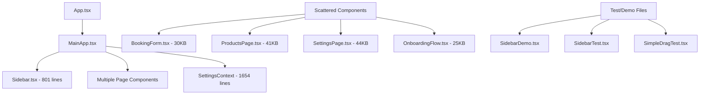
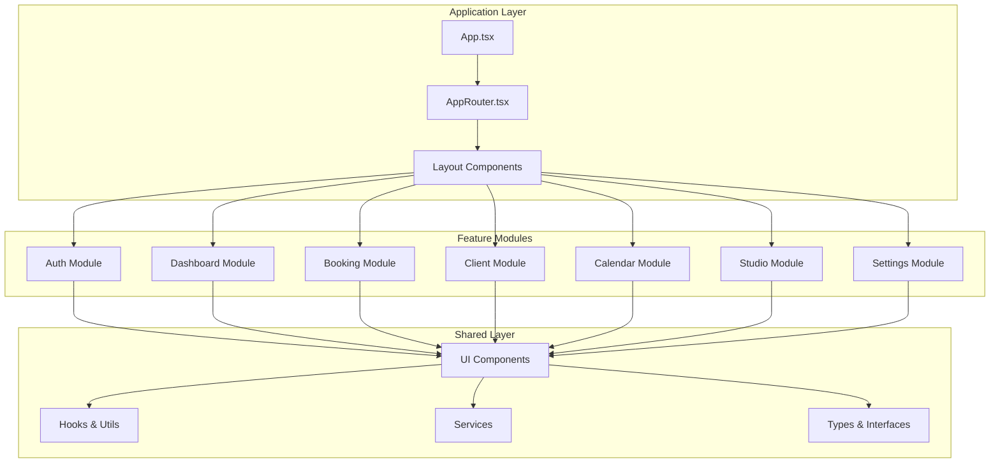
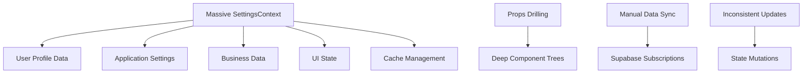
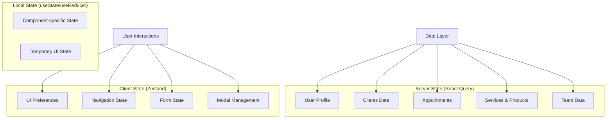
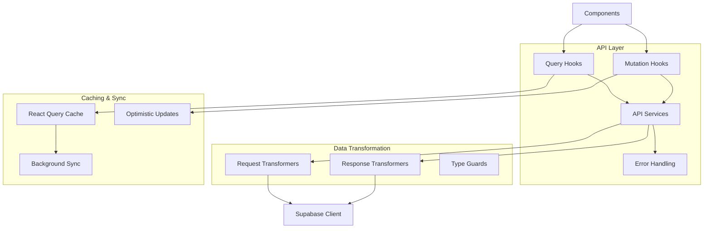
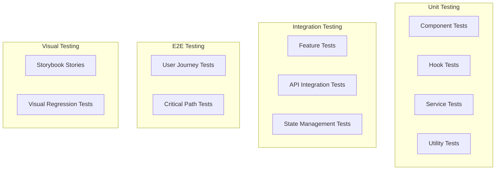

# HairstylistCRM Application Refactoring Design

## Overview

This document outlines a comprehensive refactoring strategy for the HairstylistCRM application, transforming it from its current monolithic React structure into a modern, scalable, and maintainable frontend application. The refactoring addresses architectural debt, improves code organization, enhances performance, and establishes better development practices.

**Current State Analysis:**
- Large monolithic components (SettingsContext.tsx: 1654 lines)
- Scattered component organization with mixed responsibilities
- Inconsistent state management patterns
- Multiple test/demo files indicating experimental development
- Complex drag-and-drop functionality with manual event handling
- Extensive use of inline styles and mixed styling approaches

## Technology Stack & Dependencies

**Current Stack:**
- React 19.1.1 with functional components and hooks
- Vite 6.2.0 for build tooling
- TypeScript 5.8.2 for type safety
- Supabase for backend services and authentication
- Google Gemini API for AI-powered hairstyle generation

**Refactored Stack Enhancements:**
- Maintain React 19.1.1 with improved component architecture
- Implement React Query/TanStack Query for server state management
- Introduce Zustand for client-side state management
- Add React Hook Form for form management
- Implement React Router for navigation
- Integrate Tailwind CSS for consistent styling
- Add Storybook for component documentation

## Component Architecture

### Current Component Hierarchy Issues



### Refactored Component Architecture



### Component Definition Standards

**Container Components:**
- Handle business logic and state management
- Connect to external services and APIs
- Manage data fetching and mutations
- Maximum 200 lines per component

**Presentation Components:**
- Pure functional components focused on UI rendering
- Receive props for all data and callbacks
- No direct API calls or complex business logic
- Maximum 100 lines per component

**Hook Components:**
- Custom hooks for reusable logic
- Handle specific concerns (data fetching, form validation, etc.)
- Return consistent interfaces
- Maximum 50 lines per hook

## Routing & Navigation

### Current Navigation Issues
- View switching handled manually in MainApp.tsx
- No URL-based routing or deep linking support
- Complex fade animations for view transitions
- Tightly coupled navigation logic

### Refactored Routing Structure

```mermaid
graph LR
    A[/ - Landing] --> B[/auth - Authentication]
    A --> C[/app - Main Application]
    
    C --> D[/app/dashboard]
    C --> E[/app/booking]
    C --> F[/app/studio]
    C --> G[/app/clients/:id?]
    C --> H[/app/calendar]
    C --> I[/app/services]
    C --> J[/app/products]
    C --> K[/app/team]
    C --> L[/app/pos]
    C --> M[/app/analytics]
    C --> N[/app/reports]
    C --> O[/app/marketing]
    C --> P[/app/social]
    C --> Q[/app/settings]
```

**Navigation Features:**
- URL-based routing with React Router v6
- Protected routes with authentication guards
- Breadcrumb navigation for complex workflows
- Deep linking support for all major views
- Browser history management

## State Management

### Current State Management Issues



### Refactored State Architecture



**State Management Strategy:**
- **React Query**: Server state, caching, synchronization
- **Zustand**: Global client state with persistence
- **React Hook Form**: Form state and validation
- **Local State**: Component-specific temporary state

## Styling Strategy

### Current Styling Issues
- Mixed styling approaches (CSS classes, inline styles, CSS-in-JS)
- Inconsistent theming implementation
- Manual accent color management
- Large style files with global scope pollution

### Refactored Styling Architecture

**Tailwind CSS Integration:**
- Utility-first CSS framework
- Consistent design tokens
- Dark mode support with CSS variables
- Custom accent color system

**Component Styling Pattern:**
```typescript
// Theme-aware component with Tailwind
const Button = ({ variant, children, ...props }) => {
  const baseClasses = 'px-4 py-2 rounded-md font-medium transition-colors'
  const variantClasses = {
    primary: 'bg-accent text-white hover:bg-accent/90',
    secondary: 'bg-gray-200 text-gray-900 hover:bg-gray-300'
  }
  
  return (
    <button 
      className={cn(baseClasses, variantClasses[variant])}
      {...props}
    >
      {children}
    </button>
  )
}
```

## API Integration Layer

### Current API Issues
- Supabase client usage scattered throughout components
- Manual subscription management
- Inconsistent error handling
- No request/response transformation layer

### Refactored API Architecture



**API Integration Features:**
- Centralized API service layer
- Automatic request/response transformation
- Consistent error handling and user feedback
- Optimistic updates for better UX
- Background synchronization

## Business Logic Layer

### Current Business Logic Issues
- Business rules scattered across components
- Duplicate validation logic
- Complex calculations inline in components
- No clear separation of concerns

### Refactored Business Logic Architecture

**Domain Services:**
```typescript
// Example: AppointmentService
class AppointmentService {
  static calculateDuration(appointment: Appointment, services: Service[]): number
  static detectConflicts(appointments: Appointment[]): AppointmentConflict[]
  static validateBooking(booking: BookingRequest): ValidationResult
  static generateTimeSlots(date: Date, hairstylist: Hairstylist): TimeSlot[]
}
```

**Business Rules Engine:**
- Centralized validation rules
- Reusable calculation functions
- Domain-specific utilities
- Consistent business logic across features

## Testing Strategy

### Current Testing Gaps
- No existing test infrastructure
- Large components difficult to test
- Tightly coupled dependencies
- Manual testing only

### Refactored Testing Architecture



**Testing Tools:**
- **Jest + React Testing Library**: Unit and integration tests
- **MSW (Mock Service Worker)**: API mocking
- **Playwright**: End-to-end testing
- **Storybook**: Component documentation and visual testing

## Performance Optimization

### Current Performance Issues
- Large bundle sizes from monolithic components
- No code splitting implementation
- Inefficient re-renders from large contexts
- Manual drag-and-drop with performance bottlenecks

### Performance Enhancement Strategy

**Code Splitting:**
```typescript
// Route-based code splitting
const Dashboard = lazy(() => import('./features/dashboard/Dashboard'))
const BookingModule = lazy(() => import('./features/booking'))
const StudioModule = lazy(() => import('./features/studio'))
```

**Optimization Techniques:**
- Route-based code splitting
- Component lazy loading
- Image optimization and lazy loading
- Virtual scrolling for large lists
- Memoization of expensive calculations
- Bundle size analysis and optimization

## Migration Strategy

### Phase 1: Foundation (Weeks 1-2)
1. **Project Setup**
   - Configure new build tooling and dependencies
   - Set up testing infrastructure
   - Implement basic routing structure

2. **Core Infrastructure**
   - Create shared component library
   - Implement state management architecture
   - Set up API integration layer

### Phase 2: Feature Migration (Weeks 3-6)
1. **Authentication Module** (Week 3)
   - Extract auth components
   - Implement protected routing
   - Add form validation

2. **Dashboard & Navigation** (Week 3-4)
   - Refactor MainApp and Sidebar
   - Implement new navigation system
   - Create responsive layout components

3. **Core Features** (Week 4-6)
   - Migrate booking system
   - Refactor client management
   - Update calendar functionality

### Phase 3: Advanced Features (Weeks 7-10)
1. **Studio & AI Integration** (Week 7-8)
   - Optimize AI workflow components
   - Implement image processing pipeline
   - Add advanced studio features

2. **Business Features** (Week 9-10)
   - Migrate POS and reporting
   - Update marketing tools
   - Implement team management

### Phase 4: Polish & Launch (Weeks 11-12)
1. **Testing & Quality Assurance**
   - Comprehensive test coverage
   - Performance optimization
   - Security audit

2. **Documentation & Deployment**
   - Component documentation
   - User guides
   - Production deployment

## File Structure Reorganization

### Current Structure Issues
- Components scattered in multiple locations
- Inconsistent naming conventions
- Missing feature boundaries
- Test files mixed with implementation

### Refactored Directory Structure

```
src/
├── app/                          # Application configuration
│   ├── App.tsx
│   ├── AppRouter.tsx
│   └── providers/
├── features/                     # Feature-based modules
│   ├── auth/
│   │   ├── components/
│   │   ├── hooks/
│   │   ├── services/
│   │   └── types/
│   ├── dashboard/
│   ├── booking/
│   ├── clients/
│   ├── calendar/
│   ├── studio/
│   └── settings/
├── shared/                       # Shared resources
│   ├── components/               # Reusable UI components
│   │   ├── ui/                  # Basic UI elements
│   │   ├── forms/               # Form components
│   │   └── layout/              # Layout components
│   ├── hooks/                   # Custom hooks
│   ├── services/                # API services
│   ├── utils/                   # Utility functions
│   ├── types/                   # TypeScript definitions
│   └── constants/               # Application constants
├── assets/                      # Static assets
└── styles/                      # Global styles
```

## Component Refactoring Examples

### Before: Monolithic SettingsContext
```typescript
// 1654 lines of mixed concerns
const SettingsContext = createContext<SettingsContextType>()
export const SettingsProvider = ({ children }) => {
  // Massive component with all application state
  // Mixed UI state, business logic, and data management
}
```

### After: Modular State Management
```typescript
// User profile management
export const useUserProfile = () => {
  return useQuery(['user-profile'], fetchUserProfile)
}

// Application settings
export const useAppSettings = () => {
  const settings = useSettingsStore()
  return settings
}

// Business data hooks
export const useClients = () => {
  return useQuery(['clients'], fetchClients)
}
```

### Before: Complex Sidebar Component
```typescript
// 801 lines with drag-and-drop, menu management, and UI logic
const Sidebar = ({ activeView, onNavigate, isCollapsed, onToggle, onLogout }) => {
  // Complex manual drag-and-drop implementation
  // Mixed navigation and customization logic
  // Inline event handlers and state management
}
```

### After: Modular Sidebar Architecture
```typescript
// Main sidebar component
const Sidebar = () => {
  const { isCollapsed } = useLayoutStore()
  const menuItems = useMenuItems()
  
  return (
    <nav className="sidebar">
      <SidebarHeader />
      <SidebarNavigation items={menuItems} />
      <SidebarFooter />
    </nav>
  )
}

// Separate customization component
const SidebarCustomizer = () => {
  const { updateMenuOrder } = useMenuCustomization()
  
  return (
    <DragDropProvider onReorder={updateMenuOrder}>
      <MenuItemList />
    </DragDropProvider>
  )
}
```

## Quality Assurance

### Code Standards
- ESLint + Prettier for code formatting
- Husky + lint-staged for pre-commit hooks
- TypeScript strict mode enabled
- Consistent naming conventions

### Performance Metrics
- Bundle size < 500KB (main chunk)
- First Contentful Paint < 1.5s
- Largest Contentful Paint < 2.5s
- Time to Interactive < 3s

### Accessibility Standards
- WCAG 2.1 AA compliance
- Semantic HTML structure
- Proper ARIA labels and roles
- Keyboard navigation support
- Screen reader compatibility

## Risk Mitigation

### Technical Risks
1. **Breaking Changes**: Comprehensive testing and gradual migration
2. **Performance Regression**: Continuous performance monitoring
3. **Data Loss**: Backup strategies and rollback procedures
4. **User Experience Disruption**: Feature flags and A/B testing

### Business Risks
1. **Development Timeline**: Phased approach with MVP releases
2. **User Adoption**: Training materials and migration guides
3. **Maintenance Overhead**: Documentation and knowledge transfer