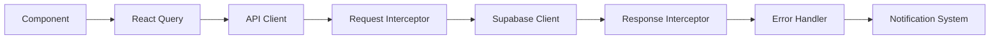

# HairstylistCRM Application Refactoring Design

## Overview

This document outlines a comprehensive refactoring strategy for the HairstylistCRM application, transforming it from its current monolithic React structure into a modern, scalable, and maintainable frontend application. The refactoring addresses architectural debt, improves code organization, enhances performance, and establishes better development practices.

**Current State Analysis:**
- Large monolithic components (SettingsContext.tsx: 1654 lines)
- Scattered component organization with mixed responsibilities
- Inconsistent state management patterns
- Multiple test/demo files indicating experimental development
- Complex drag-and-drop functionality with manual event handling
- Extensive use of inline styles and mixed styling approaches

## Technology Stack & Dependencies

**Current Stack:**
- React 19.1.1 with functional components and hooks
- Vite 6.2.0 for build tooling
- TypeScript 5.8.2 for type safety
- Supabase for backend services and authentication
- Google Gemini API for AI-powered hairstyle generation

**Refactored Stack Enhancements:**
- Maintain React 19.1.1 with improved component architecture
- Implement React Query/TanStack Query for server state management
- Introduce Zustand for client-side state management
- Add React Hook Form for form management
- Implement React Router for navigation
- Integrate Tailwind CSS for consistent styling
- Add Storybook for component documentation

## Component Architecture

### Current Component Hierarchy Issues


### Refactored Component Architecture


### Component Definition Standards

**Container Components:**
- Handle business logic and state management
- Connect to external services and APIs
- Manage data fetching and mutations
- Maximum 200 lines per component

**Presentation Components:**
- Pure functional components focused on UI rendering
- Receive props for all data and callbacks
- No direct API calls or complex business logic
- Maximum 100 lines per component

**Hook Components:**
- Custom hooks for reusable logic
- Handle specific concerns (data fetching, form validation, etc.)
- Return consistent interfaces
- Maximum 50 lines per hook

## Routing & Navigation

### Current Navigation Issues
- View switching handled manually in MainApp.tsx
- No URL-based routing or deep linking support
- Complex fade animations for view transitions
- Tightly coupled navigation logic

### Refactored Routing Structure

```mermaid
graph LR
    A[/ - Landing] --> B[/auth - Authentication]
    A --> C[/app - Main Application]
    
    C --> D[/app/dashboard]
    C --> E[/app/booking]
    C --> F[/app/studio]
    C --> G[/app/clients/:id?]
    C --> H[/app/calendar]
    C --> I[/app/services]
    C --> J[/app/products]
    C --> K[/app/team]
    C --> L[/app/pos]
    C --> M[/app/analytics]
    C --> N[/app/reports]
    C --> O[/app/marketing]
    C --> P[/app/social]
    C --> Q[/app/settings]
```

**Navigation Features:**
- URL-based routing with React Router v6
- Protected routes with authentication guards
- Breadcrumb navigation for complex workflows
- Deep linking support for all major views
- Browser history management

## State Management

### Current State Management Issues


### Refactored State Architecture


**State Management Strategy:**
- **React Query**: Server state, caching, synchronization
- **Zustand**: Global client state with persistence
- **React Hook Form**: Form state and validation
- **Local State**: Component-specific temporary state

## Styling Strategy

### Current Styling Issues
- Mixed styling approaches (CSS classes, inline styles, CSS-in-JS)
- Inconsistent theming implementation
- Manual accent color management
- Large style files with global scope pollution

### Refactored Styling Architecture

**Tailwind CSS Integration:**
- Utility-first CSS framework
- Consistent design tokens
- Dark mode support with CSS variables
- Custom accent color system

**Component Styling Pattern:**
```typescript
// Theme-aware component with Tailwind
const Button = ({ variant, children, ...props }) => {
  const baseClasses = 'px-4 py-2 rounded-md font-medium transition-colors'
  const variantClasses = {
    primary: 'bg-accent text-white hover:bg-accent/90',
    secondary: 'bg-gray-200 text-gray-900 hover:bg-gray-300'
  }
  
  return (
    <button 
      className={cn(baseClasses, variantClasses[variant])}
      {...props}
    >
      {children}
    </button>
  )
}
```

## API Integration Layer

### Current API Issues
- Supabase client usage scattered throughout components
- Manual subscription management
- Inconsistent error handling
- No request/response transformation layer

### Refactored API Architecture


**API Integration Features:**
- Centralized API service layer
- Automatic request/response transformation
- Consistent error handling and user feedback
- Optimistic updates for better UX
- Background synchronization

## Business Logic Layer

### Current Business Logic Issues
- Business rules scattered across components
- Duplicate validation logic
- Complex calculations inline in components
- No clear separation of concerns

### Refactored Business Logic Architecture

**Domain Services:**
```typescript
// Example: AppointmentService
class AppointmentService {
  static calculateDuration(appointment: Appointment, services: Service[]): number
  static detectConflicts(appointments: Appointment[]): AppointmentConflict[]
  static validateBooking(booking: BookingRequest): ValidationResult
  static generateTimeSlots(date: Date, hairstylist: Hairstylist): TimeSlot[]
}
```

**Business Rules Engine:**
- Centralized validation rules
- Reusable calculation functions
- Domain-specific utilities
- Consistent business logic across features

## Testing Strategy

### Current Testing Gaps
- No existing test infrastructure
- Large components difficult to test
- Tightly coupled dependencies
- Manual testing only

### Refactored Testing Architecture


**Testing Tools:**
- **Jest + React Testing Library**: Unit and integration tests
- **MSW (Mock Service Worker)**: API mocking
- **Playwright**: End-to-end testing
- **Storybook**: Component documentation and visual testing

## Performance Optimization

### Current Performance Issues
- Large bundle sizes from monolithic components
- No code splitting implementation
- Inefficient re-renders from large contexts
- Manual drag-and-drop with performance bottlenecks

### Performance Enhancement Strategy

**Code Splitting:**
```typescript
// Route-based code splitting
const Dashboard = lazy(() => import('./features/dashboard/Dashboard'))
const BookingModule = lazy(() => import('./features/booking'))
const StudioModule = lazy(() => import('./features/studio'))
```

**Optimization Techniques:**
- Route-based code splitting
- Component lazy loading
- Image optimization and lazy loading
- Virtual scrolling for large lists
- Memoization of expensive calculations
- Bundle size analysis and optimization

## Migration Strategy

### Phase 1: Foundation (Weeks 1-2)
1. **Project Setup**
   - Configure new build tooling and dependencies
   - Set up testing infrastructure
   - Implement basic routing structure

2. **Core Infrastructure**
   - Create shared component library
   - Implement state management architecture
   - Set up API integration layer

### Phase 2: Feature Migration (Weeks 3-6)
1. **Authentication Module** (Week 3)
   - Extract auth components
   - Implement protected routing
   - Add form validation

2. **Dashboard & Navigation** (Week 3-4)
   - Refactor MainApp and Sidebar
   - Implement new navigation system
   - Create responsive layout components

3. **Core Features** (Week 4-6)
   - Migrate booking system
   - Refactor client management
   - Update calendar functionality

### Phase 3: Advanced Features (Weeks 7-10)
1. **Studio & AI Integration** (Week 7-8)
   - Optimize AI workflow components
   - Implement image processing pipeline
   - Add advanced studio features

2. **Business Features** (Week 9-10)
   - Migrate POS and reporting
   - Update marketing tools
   - Implement team management

### Phase 4: Polish & Launch (Weeks 11-12)
1. **Testing & Quality Assurance**
   - Comprehensive test coverage
   - Performance optimization
   - Security audit

2. **Documentation & Deployment**
   - Component documentation
   - User guides
   - Production deployment

## File Structure Reorganization

### Current Structure Issues
- Components scattered in multiple locations
- Inconsistent naming conventions
- Missing feature boundaries
- Test files mixed with implementation

### Refactored Directory Structure

```
src/
├── app/                          # Application configuration
│   ├── App.tsx
│   ├── AppRouter.tsx
│   └── providers/
├── features/                     # Feature-based modules
│   ├── auth/
│   │   ├── components/
│   │   ├── hooks/
│   │   ├── services/
│   │   └── types/
│   ├── dashboard/
│   ├── booking/
│   ├── clients/
│   ├── calendar/
│   ├── studio/
│   └── settings/
├── shared/                       # Shared resources
│   ├── components/               # Reusable UI components
│   │   ├── ui/                  # Basic UI elements
│   │   ├── forms/               # Form components
│   │   └── layout/              # Layout components
│   ├── hooks/                   # Custom hooks
│   ├── services/                # API services
│   ├── utils/                   # Utility functions
│   ├── types/                   # TypeScript definitions
│   └── constants/               # Application constants
├── assets/                      # Static assets
└── styles/                      # Global styles
```

## Component Refactoring Examples

### Before: Monolithic SettingsContext
```typescript
// 1654 lines of mixed concerns
const SettingsContext = createContext<SettingsContextType>()
export const SettingsProvider = ({ children }) => {
  // Massive component with all application state
  // Mixed UI state, business logic, and data management
}
```

### After: Modular State Management
```typescript
// User profile management
export const useUserProfile = () => {
  return useQuery(['user-profile'], fetchUserProfile)
}

// Application settings
export const useAppSettings = () => {
  const settings = useSettingsStore()
  return settings
}

// Business data hooks
export const useClients = () => {
  return useQuery(['clients'], fetchClients)
}
```

### Before: Complex Sidebar Component
```typescript
// 801 lines with drag-and-drop, menu management, and UI logic
const Sidebar = ({ activeView, onNavigate, isCollapsed, onToggle, onLogout }) => {
  // Complex manual drag-and-drop implementation
  // Mixed navigation and customization logic
  // Inline event handlers and state management
}
```

### After: Modular Sidebar Architecture
```typescript
// Main sidebar component
const Sidebar = () => {
  const { isCollapsed } = useLayoutStore()
  const menuItems = useMenuItems()
  
  return (
    <nav className="sidebar">
      <SidebarHeader />
      <SidebarNavigation items={menuItems} />
      <SidebarFooter />
    </nav>
  )
}

// Separate customization component
const SidebarCustomizer = () => {
  const { updateMenuOrder } = useMenuCustomization()
  
  return (
    <DragDropProvider onReorder={updateMenuOrder}>
      <MenuItemList />
    </DragDropProvider>
  )
}
```

## Quality Assurance

### Code Standards
- ESLint + Prettier for code formatting
- Husky + lint-staged for pre-commit hooks
- TypeScript strict mode enabled
- Consistent naming conventions

### Performance Metrics
- Bundle size < 500KB (main chunk)
- First Contentful Paint < 1.5s
- Largest Contentful Paint < 2.5s
- Time to Interactive < 3s

### Accessibility Standards
- WCAG 2.1 AA compliance
- Semantic HTML structure
- Proper ARIA labels and roles
- Keyboard navigation support
- Screen reader compatibility

## Middleware & Interceptors

### Current Request/Response Handling Issues
- No centralized error handling
- Inconsistent loading states across components
- Manual retry logic scattered throughout
- No request/response logging or monitoring

### Refactored Middleware Architecture



**Request Interceptors:**
```typescript
// Authentication interceptor
const authInterceptor = (config: RequestConfig) => {
  const token = getAuthToken()
  if (token) {
    config.headers.Authorization = `Bearer ${token}`
  }
  return config
}

// Loading state interceptor
const loadingInterceptor = (config: RequestConfig) => {
  useLoadingStore.getState().setLoading(config.url, true)
  return config
}
```

**Response Interceptors:**
```typescript
// Error handling interceptor
const errorInterceptor = (error: ApiError) => {
  const { status, message, code } = error
  
  switch (status) {
    case 401:
      // Handle authentication errors
      authStore.logout()
      router.push('/auth')
      break
    case 403:
      // Handle authorization errors
      notificationStore.error('Access denied')
      break
    case 500:
      // Handle server errors
      notificationStore.error('Server error occurred')
      break
    default:
      notificationStore.error(message || 'Unknown error')
  }
  
  return Promise.reject(error)
}
```

## Advanced Component Patterns

### Compound Components Pattern

**Current Modal Implementation Issues:**
- Inconsistent modal behavior across features
- Duplicate modal logic in multiple components
- No standardized modal API

**Refactored Modal System:**
```typescript
// Compound modal component
const Modal = ({ children, isOpen, onClose }) => {
  return (
    <ModalProvider value={{ isOpen, onClose }}>
      <AnimatePresence>
        {isOpen && (
          <Portal>
            <ModalOverlay>
              <ModalContainer>
                {children}
              </ModalContainer>
            </ModalOverlay>
          </Portal>
        )}
      </AnimatePresence>
    </ModalProvider>
  )
}

Modal.Header = ModalHeader
Modal.Body = ModalBody
Modal.Footer = ModalFooter
Modal.CloseButton = ModalCloseButton

// Usage
<Modal isOpen={isOpen} onClose={onClose}>
  <Modal.Header>
    <h2>Edit Client</h2>
    <Modal.CloseButton />
  </Modal.Header>
  <Modal.Body>
    <ClientForm client={client} />
  </Modal.Body>
  <Modal.Footer>
    <Button variant="outline" onClick={onClose}>Cancel</Button>
    <Button variant="primary" onClick={onSave}>Save</Button>
  </Modal.Footer>
</Modal>
```

### Render Props Pattern for Data Fetching

```typescript
// Generic data fetcher component
const DataFetcher = ({ query, children }) => {
  const { data, loading, error, refetch } = useQuery(query)
  
  return children({ data, loading, error, refetch })
}

// Usage in components
<DataFetcher query={['clients']}>
  {({ data: clients, loading, error, refetch }) => {
    if (loading) return <LoadingSpinner />
    if (error) return <ErrorMessage error={error} onRetry={refetch} />
    return <ClientList clients={clients} />
  }}
</DataFetcher>
```

## Form Management Architecture

### Current Form Issues
- Large form components with mixed validation
- Duplicate form logic across features
- Inconsistent error handling and display
- No form state persistence

### Refactored Form System

```typescript
// Form schema definition
const clientFormSchema = z.object({
  name: z.string().min(2, 'Name must be at least 2 characters'),
  email: z.string().email('Invalid email address'),
  phone: z.string().regex(/^\+?[1-9]\d{1,14}$/, 'Invalid phone number'),
  address: z.string().optional(),
  notes: z.string().optional()
})

// Reusable form hook
const useClientForm = (initialData?: Client) => {
  const form = useForm({
    resolver: zodResolver(clientFormSchema),
    defaultValues: initialData || {
      name: '',
      email: '',
      phone: '',
      address: '',
      notes: ''
    }
  })
  
  const { mutate: saveClient, isLoading } = useMutation({
    mutationFn: initialData ? updateClient : createClient,
    onSuccess: () => {
      notificationStore.success(
        initialData ? 'Client updated successfully' : 'Client created successfully'
      )
      queryClient.invalidateQueries(['clients'])
    },
    onError: (error) => {
      notificationStore.error(`Failed to save client: ${error.message}`)
    }
  })
  
  const onSubmit = (data: ClientFormData) => {
    saveClient(data)
  }
  
  return { form, onSubmit, isLoading }
}

// Form component
const ClientForm = ({ client, onSuccess }) => {
  const { form, onSubmit, isLoading } = useClientForm(client)
  
  return (
    <Form {...form}>
      <form onSubmit={form.handleSubmit(onSubmit)} className="space-y-4">
        <FormField
          control={form.control}
          name="name"
          render={({ field }) => (
            <FormItem>
              <FormLabel>Name</FormLabel>
              <FormControl>
                <Input placeholder="Client name" {...field} />
              </FormControl>
              <FormMessage />
            </FormItem>
          )}
        />
        
        <FormField
          control={form.control}
          name="email"
          render={({ field }) => (
            <FormItem>
              <FormLabel>Email</FormLabel>
              <FormControl>
                <Input type="email" placeholder="client@example.com" {...field} />
              </FormControl>
              <FormMessage />
            </FormItem>
          )}
        />
        
        <Button type="submit" disabled={isLoading}>
          {isLoading ? 'Saving...' : 'Save Client'}
        </Button>
      </form>
    </Form>
  )
}
```

## Data Synchronization Strategy

### Real-time Updates with Optimistic UI

```typescript
// Optimistic update hook
const useOptimisticMutation = ({
  mutationFn,
  queryKey,
  optimisticUpdate
}) => {
  const queryClient = useQueryClient()
  
  return useMutation({
    mutationFn,
    onMutate: async (variables) => {
      // Cancel ongoing queries
      await queryClient.cancelQueries(queryKey)
      
      // Get current data
      const previousData = queryClient.getQueryData(queryKey)
      
      // Optimistically update cache
      queryClient.setQueryData(queryKey, (old) => 
        optimisticUpdate(old, variables)
      )
      
      return { previousData }
    },
    onError: (error, variables, context) => {
      // Rollback on error
      if (context?.previousData) {
        queryClient.setQueryData(queryKey, context.previousData)
      }
    },
    onSettled: () => {
      // Refetch to ensure consistency
      queryClient.invalidateQueries(queryKey)
    }
  })
}

// Usage for appointment updates
const useUpdateAppointment = () => {
  return useOptimisticMutation({
    mutationFn: updateAppointment,
    queryKey: ['appointments'],
    optimisticUpdate: (appointments, updatedAppointment) => 
      appointments.map(apt => 
        apt.id === updatedAppointment.id 
          ? { ...apt, ...updatedAppointment }
          : apt
      )
  })
}
```

### Background Sync for Offline Support

```typescript
// Background sync service
class BackgroundSyncService {
  private queue: SyncOperation[] = []
  private isOnline = navigator.onLine
  
  constructor() {
    window.addEventListener('online', this.processPendingOperations)
    window.addEventListener('offline', this.handleOffline)
  }
  
  async enqueue(operation: SyncOperation) {
    if (this.isOnline) {
      try {
        await this.executeOperation(operation)
      } catch (error) {
        this.queue.push(operation)
        throw error
      }
    } else {
      this.queue.push(operation)
    }
  }
  
  private async processPendingOperations = async () => {
    this.isOnline = true
    
    while (this.queue.length > 0) {
      const operation = this.queue.shift()
      try {
        await this.executeOperation(operation)
      } catch (error) {
        // Re-queue failed operations
        this.queue.unshift(operation)
        break
      }
    }
  }
  
  private handleOffline = () => {
    this.isOnline = false
  }
}
```

## Error Boundary Implementation

### Global Error Handling

```typescript
// Error boundary component
class GlobalErrorBoundary extends Component<
  PropsWithChildren<{}>,
  { hasError: boolean; error?: Error }
> {
  constructor(props: PropsWithChildren<{}>) {
    super(props)
    this.state = { hasError: false }
  }
  
  static getDerivedStateFromError(error: Error) {
    return { hasError: true, error }
  }
  
  componentDidCatch(error: Error, errorInfo: ErrorInfo) {
    console.error('Global error caught:', error, errorInfo)
    
    // Send to error reporting service
    errorReportingService.captureException(error, {
      extra: errorInfo,
      tags: { component: 'ErrorBoundary' }
    })
  }
  
  render() {
    if (this.state.hasError) {
      return (
        <ErrorFallback
          error={this.state.error}
          resetError={() => this.setState({ hasError: false, error: undefined })}
        />
      )
    }
    
    return this.props.children
  }
}

// Feature-specific error boundaries
const FeatureErrorBoundary = ({ children, fallback, onError }) => {
  return (
    <ErrorBoundary
      FallbackComponent={fallback}
      onError={onError}
      onReset={() => window.location.reload()}
    >
      {children}
    </ErrorBoundary>
  )
}
```

## Performance Monitoring

### Runtime Performance Tracking

```typescript
// Performance monitoring service
class PerformanceMonitor {
  private metrics: Map<string, PerformanceMetric> = new Map()
  
  startMeasure(name: string) {
    performance.mark(`${name}-start`)
  }
  
  endMeasure(name: string) {
    performance.mark(`${name}-end`)
    performance.measure(name, `${name}-start`, `${name}-end`)
    
    const measure = performance.getEntriesByName(name)[0]
    this.metrics.set(name, {
      duration: measure.duration,
      timestamp: Date.now()
    })
    
    // Report slow operations
    if (measure.duration > 100) {
      console.warn(`Slow operation detected: ${name} took ${measure.duration}ms`)
    }
  }
  
  getMetrics() {
    return Object.fromEntries(this.metrics)
  }
}

// Hook for component performance monitoring
const usePerformanceMonitor = (componentName: string) => {
  const monitor = useRef(new PerformanceMonitor())
  
  useEffect(() => {
    monitor.current.startMeasure(`${componentName}-render`)
    return () => {
      monitor.current.endMeasure(`${componentName}-render`)
    }
  })
  
  return monitor.current
}
```

## Security Implementation

### Input Sanitization and Validation

```typescript
// Input sanitization utilities
const sanitizeInput = (input: string): string => {
  return DOMPurify.sanitize(input, {
    ALLOWED_TAGS: [],
    ALLOWED_ATTR: []
  })
}

// XSS protection hook
const useSafeHTML = (htmlContent: string) => {
  return useMemo(() => {
    return {
      __html: DOMPurify.sanitize(htmlContent, {
        ALLOWED_TAGS: ['p', 'br', 'strong', 'em', 'ul', 'ol', 'li'],
        ALLOWED_ATTR: ['class']
      })
    }
  }, [htmlContent])
}

// CSRF protection
const useCSRFToken = () => {
  const [token, setToken] = useState<string | null>(null)
  
  useEffect(() => {
    // Get CSRF token from meta tag or API
    const csrfToken = document.querySelector('meta[name="csrf-token"]')?.getAttribute('content')
    setToken(csrfToken)
  }, [])
  
  return token
}
```

## Deployment Configuration

### Environment-specific Builds

```typescript
// Environment configuration
const config = {
  development: {
    apiUrl: 'http://localhost:3000',
    enableDevTools: true,
    logLevel: 'debug'
  },
  staging: {
    apiUrl: 'https://staging-api.hairstylist-crm.com',
    enableDevTools: false,
    logLevel: 'info'
  },
  production: {
    apiUrl: 'https://api.hairstylist-crm.com',
    enableDevTools: false,
    logLevel: 'error'
  }
}[process.env.NODE_ENV || 'development']

// Build optimization configuration
export default defineConfig({
  build: {
    rollupOptions: {
      output: {
        manualChunks: {
          vendor: ['react', 'react-dom'],
          ui: ['@radix-ui/react-dialog', '@radix-ui/react-dropdown-menu'],
          charts: ['recharts'],
          ai: ['@google/genai']
        }
      }
    },
    chunkSizeWarningLimit: 1000
  },
  optimizeDeps: {
    include: ['react', 'react-dom', '@supabase/supabase-js']
  }
})
```

## Risk Mitigation

### Technical Risks
1. **Breaking Changes**: Comprehensive testing and gradual migration
2. **Performance Regression**: Continuous performance monitoring
3. **Data Loss**: Backup strategies and rollback procedures
4. **User Experience Disruption**: Feature flags and A/B testing

### Business Risks
1. **Development Timeline**: Phased approach with MVP releases
2. **User Adoption**: Training materials and migration guides
3. **Maintenance Overhead**: Documentation and knowledge transfer