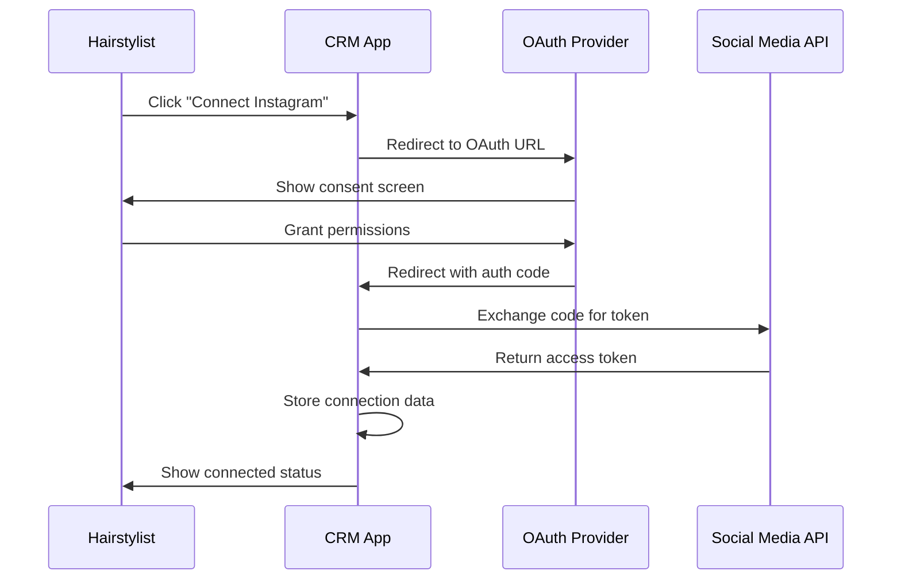
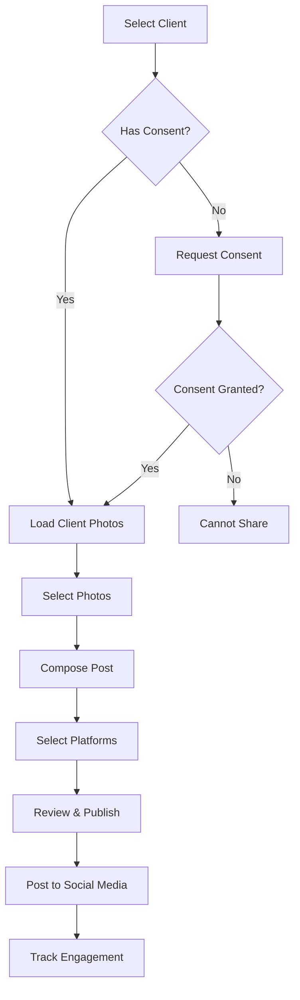

# Social Media Integration Feature Design

## Overview

This design document outlines the implementation of social media integration features for the HairstylistCRM marketing module. The feature will enable hairstylists to connect their professional social media accounts (Instagram, Facebook, TikTok) and seamlessly share client transformation photos with proper consent management.

## Technology Stack & Dependencies

**Frontend Framework**: React with TypeScript  
**State Management**: React Context API (SettingsContext)  
**UI Components**: Custom component library (Card, Button, Modal, Icons)  
**Backend**: Supabase for data persistence  
**APIs**: Social media platform APIs for authentication and posting  
**Build Tool**: Vite

## Component Architecture

### Component Hierarchy
```
MarketingPage
├── CampaignsTab
├── SegmentsTab  
├── CouponsTab
└── SocialMediaTab (New)
    ├── ConnectionManager
    ├── PhotoSelector
    ├── PostComposer
    └── PostHistory
```

### Component Definition

#### SocialMediaTab Component
- **Purpose**: Main container for social media integration features
- **State Management**: Local state for UI interactions, global state for connections
- **Props**: None (uses SettingsContext)

#### ConnectionManager Component
- **Purpose**: Handle OAuth connections to social media platforms
- **State**: Platform connection status, authentication tokens
- **Methods**: `connectPlatform()`, `disconnectPlatform()`, `refreshToken()`

#### PhotoSelector Component  
- **Purpose**: Browse and select client photos with consent verification
- **State**: Selected client, available photos, selected images
- **Methods**: `loadClientPhotos()`, `selectPhoto()`, `verifyConsent()`

#### PostComposer Component
- **Purpose**: Compose posts with captions, hashtags, and platform selection
- **State**: Caption text, selected platforms, post metadata
- **Methods**: `generateCaption()`, `schedulePost()`, `publishPost()`

## API Endpoints Reference

### Social Media Platform APIs

#### Instagram Basic Display API
```typescript
interface InstagramConnection {
  accessToken: string;
  userId: string;
  username: string;
  expiresAt: Date;
}

// Authentication Flow
POST /auth/instagram/connect
GET /auth/instagram/callback
POST /auth/instagram/refresh

// Media Publishing
POST /instagram/media
POST /instagram/publish
```

#### Facebook Graph API
```typescript
interface FacebookConnection {
  accessToken: string;
  pageId: string;
  pageName: string;
  expiresAt: Date;
}

// Authentication Flow  
POST /auth/facebook/connect
GET /auth/facebook/callback
POST /auth/facebook/refresh

// Page Publishing
POST /facebook/photos
POST /facebook/feed
```

#### TikTok API for Business
```typescript
interface TikTokConnection {
  accessToken: string;
  openId: string;
  username: string;
  expiresAt: Date;
}

// Authentication Flow
POST /auth/tiktok/connect  
GET /auth/tiktok/callback
POST /auth/tiktok/refresh

// Content Publishing
POST /tiktok/video/upload
POST /tiktok/video/publish
```

### Internal API Endpoints

#### Social Media Management
```typescript
// Connection Management
GET /api/social-connections
POST /api/social-connections/{platform}
DELETE /api/social-connections/{platform}
PUT /api/social-connections/{platform}/refresh

// Photo Management  
GET /api/client-photos/{clientId}
POST /api/client-photos/consent-check
GET /api/lookbooks/shareable

// Post Management
POST /api/social-posts
GET /api/social-posts/history
PUT /api/social-posts/{postId}/status
```

### Authentication Requirements

All social media API calls require:
- Valid OAuth2 access tokens
- Platform-specific permissions
- Rate limiting compliance
- Error handling for expired tokens

## Data Models & ORM Mapping

### Social Media Connection Model
```typescript
interface SocialMediaConnection {
  id: string;
  platform: 'instagram' | 'facebook' | 'tiktok';
  accessToken: string;
  refreshToken?: string;
  userId: string;
  username: string;
  expiresAt: Date;
  isActive: boolean;
  createdAt: Date;
  updatedAt: Date;
}
```

### Social Post Model
```typescript
interface SocialPost {
  id: string;
  lookbookId: string;
  clientId: string;
  platforms: SocialPlatform[];
  caption: string;
  hashtags: string[];
  status: 'draft' | 'scheduled' | 'published' | 'failed';
  scheduledAt?: Date;
  publishedAt?: Date;
  externalIds: Record<string, string>;
  engagementMetrics?: EngagementMetrics;
  createdAt: Date;
}

interface SocialPlatform {
  platform: 'instagram' | 'facebook' | 'tiktok';
  postId?: string;
  url?: string;
  status: 'pending' | 'published' | 'failed';
}

interface EngagementMetrics {
  likes: number;
  comments: number;
  shares: number;
  views?: number;
  lastUpdated: Date;
}
```

### Client Consent Model Extension
```typescript
interface Client {
  // ... existing fields
  socialMediaConsent: {
    hasConsented: boolean;
    consentDate?: Date;
    allowedPlatforms: string[];
    consentType: 'general' | 'per_post';
  };
}
```

## Business Logic Layer

### OAuth Authentication Flow


### Photo Sharing Workflow


### Content Publishing Architecture
```typescript
class SocialMediaPublisher {
  async publishPost(post: SocialPost): Promise<PublishResult> {
    const results: PlatformResult[] = [];
    
    for (const platform of post.platforms) {
      try {
        const connection = await this.getConnection(platform.platform);
        const result = await this.publishToPlatform(connection, post);
        results.push({ platform: platform.platform, success: true, result });
      } catch (error) {
        results.push({ platform: platform.platform, success: false, error });
      }
    }
    
    return { results, overallSuccess: results.every(r => r.success) };
  }
}
```

## Middleware & Interceptors

### Rate Limiting Middleware
```typescript
interface RateLimit {
  platform: string;
  requests: number;
  timeWindow: number; // in seconds
  remaining: number;
  resetTime: Date;
}

class RateLimitMiddleware {
  async checkRateLimit(platform: string): Promise<boolean> {
    // Check current rate limit status
    // Return true if request can proceed
  }
}
```

### Token Refresh Interceptor
```typescript
class TokenRefreshInterceptor {
  async refreshExpiredTokens(): Promise<void> {
    const expiredConnections = await this.getExpiredConnections();
    
    for (const connection of expiredConnections) {
      try {
        const newToken = await this.refreshToken(connection);
        await this.updateConnection(connection.id, newToken);
      } catch (error) {
        await this.deactivateConnection(connection.id);
      }
    }
  }
}
```

## UI Architecture & State Management

### State Structure
```typescript
interface SocialMediaState {
  connections: Record<string, SocialMediaConnection>;
  selectedClient: Client | null;
  availablePhotos: Lookbook[];
  selectedPhotos: Lookbook[];
  postDraft: {
    caption: string;
    platforms: string[];
    scheduledAt?: Date;
  };
  publishingStatus: 'idle' | 'publishing' | 'success' | 'error';
}
```

### Component Integration with MarketingPage
```typescript
// MarketingPage.tsx enhancement
const MarketingPage: React.FC = () => {
  const [activeTab, setActiveTab] = useState<MarketingTab>('campaigns');
  
  const tabOptions: MarketingTab[] = ['campaigns', 'segments', 'coupons', 'social'];
  
  return (
    <div className="animate-fade-in h-full flex flex-col">
      {/* Tab Navigation */}
      <div className="border-b border-gray-200 dark:border-gray-700">
        <nav className="-mb-px flex space-x-4">
          {tabOptions.map(tab => (
            <TabButton key={tab} tab={tab} activeTab={activeTab} onClick={setActiveTab} />
          ))}
        </nav>
      </div>
      
      {/* Tab Content */}
      <div className="flex-grow mt-6">
        {activeTab === 'social' && <SocialMediaTab />}
        {/* ... other tabs */}
      </div>
    </div>
  );
};
```

## Testing Strategy

### Unit Testing Approach
```typescript
// Example test structure
describe('SocialMediaPublisher', () => {
  test('should publish post to Instagram successfully', async () => {
    const mockConnection = createMockConnection('instagram');
    const mockPost = createMockPost();
    
    const publisher = new SocialMediaPublisher();
    const result = await publisher.publishPost(mockPost);
    
    expect(result.overallSuccess).toBe(true);
    expect(result.results).toHaveLength(1);
  });
  
  test('should handle rate limiting gracefully', async () => {
    // Test rate limiting scenarios
  });
  
  test('should refresh expired tokens automatically', async () => {
    // Test token refresh logic
  });
});
```

### Integration Testing
- OAuth flow testing with mock providers
- API endpoint testing with platform simulators  
- End-to-end posting workflow verification
- Consent management validation

### Error Handling Testing
- Network failure scenarios
- Token expiration handling
- Platform API errors
- Rate limit exceeded responses